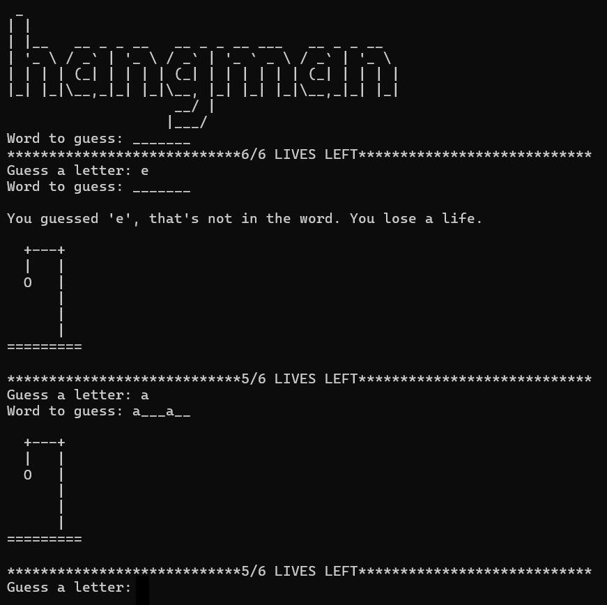

# Hangman Game

Welcome to the Hangman game! This is a classic word-guessing game where you must uncover the hidden word by guessing one letter at a time. Be careful though, you only have six lives before the game ends.

## How to Play

1. Launch the game by running `main.py` in your terminal or command prompt.
2. A random word will be selected, and you will see a series of underscores representing the letters in the word.
3. Guess one letter at a time by typing it in and pressing Enter.
4. If your guess is correct, the corresponding letters will be revealed. If not, you lose a life.
5. Continue guessing until you either:
   - Successfully guess all the letters in the word (you win!), or
   - Use up all six lives (you lose!).

<p align="center">
  
</p>

## Files

- `main.py`: The main script containing game logic, user input handling, and game flow.
- `hangman_art.py`: Includes ASCII art for the hangman stages and a logo to enhance the visual experience.
- `hangman_words.py`: Contains a rich and diverse list of words used for gameplay.

## Requirements

- Python 3.10 or higher

Run the game from the root folder:

```bash
python main.py
```

## Contributing

This project is open-source so feel free to fork this project and submit pull requests for improvements or new features. Suggestions or enhancements are always welcome!
